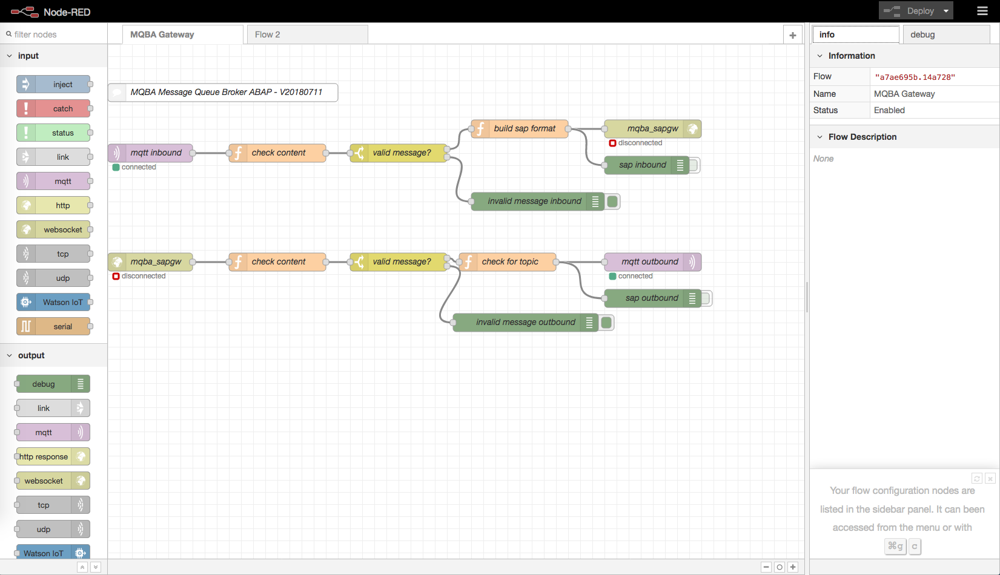

# Node-RED Gateway

The MQBA based on a Node-RED Flow as Gateway between a MQTT Broker and a SAP ABAP System. Here you can find the flow exported as JSON File.

## Installation to Node-RED
You can import this via the clipboard in your Node-Red instance.

## Connection to MQTT Broker
The MQTT Broker is configured as host mqba_mqtt_broker with port 1883 without any authorization info. If you make the hostname available on your Node-Red Server (via hosts file) there are no need to modify the flow.

Otherwise You have to check the MQTT nodes and change the connection info.

## Connection to SAP

The SAP system is configured as host mqba_sap and port 8000. If this fits to your infrastructure and you can make the host name mqba_sap available on the Node-Red-Server (via hosts file) you can use the flow as is.

Otherwise please modify the Websocket nodes (inbound and outbound) to your needs. The SAP ICF node for the Websocket is available via path ws://<hostname>:<port>/sap/bc/apc/sap/zmqba_gw.

You can check this via transaction SICF on the SAP side and a Websocket Test client at the Non-SAP-Side. Use the Plugin "Simple Websocket Client" for Chrome for example. These kind of clients cannot set authorization info. Therefore you have to set a (system) user / password via transaction SICF.

## Test and Debugging
Within the Node-RED flow some nodes for Debugging are configured. The output can be switched at the right node side. The debug infos appear at the right side of the browser in tab "debug". Switch the debug nodes to off to improve the performance after testing.

At the SAP side you can user external break-points and different kinds of trace and debug tools. Set external break-points to the ABAP code for example.

If the gateway connection between SAP and MQTT are running fine yoi can check the MQTT broker itself with some the the common MQTT clients. Here you can publish an external command and check this inside the SAP with the transaction for "List the current broker memory".

##  Experts: more than one Gateway
In theory is it possible to have more than one Node-Red Gateway. To get a separation within SAP the gatway sends a sender identification. This is configured to "nr-gateway". If you want to change this modify node "build sap format".

Good Luck!
